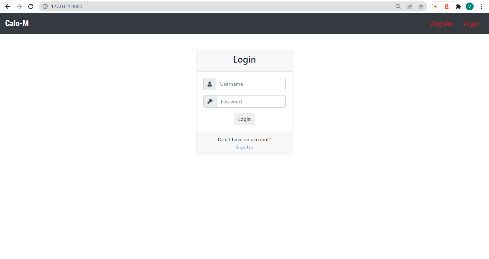
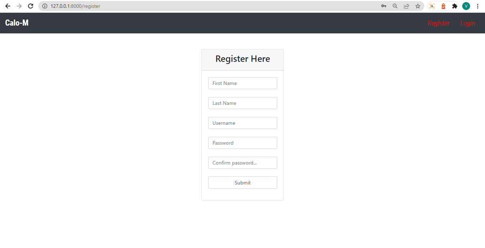
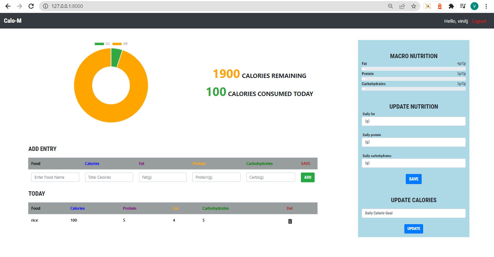

# Calo-M | Calorie Tracker

Calorie Tracker web application help's you to set & track your calories goal.

### Run locally

**Clone the Repository using:**

```
git clone https://github.com/itsvinitjain/Calo-M.git CALO-M
cd CALO-M
```

**Create virtual environment:**

```
pip install venv
python3 -m venv venv

source venv/bin/activate (for linux)
./venv/scripts/activate (for windows)
```

**Install required packages:**

pip install -r requirements.txt

Incase of difficultly psycopg2
[https://stackoverflow.com/questions/5420789/how-to-install-psycopg2-with-pip-on-python](https://stackoverflow.com/questions/5420789/how-to-install-psycopg2-with-pip-on-python)

**Setup the database:**
In the following code, replace `<PASS>` with any password of your choice.

```
sudo -u postgres psql
postgres=# create database calorietracker;
postgres=# create user postgres with encrypted password '<your password>';
postgres=# grant all privileges on database calorietracker to postgres;
```

**Setup calorieTracker/settings.py**
*(Replace the following code in settings.py)*

In the following code, replace `<your password>` with the password you created above.

```
DATABASES = {
    'default': {
        'ENGINE': 'django.db.backends.postgresql',
        'NAME': 'calorietracker',
        'USER': 'postgres',
        'PASSWORD': '<your password>',
        'HOST': 'localhost',
    }
}
```

**Then make migrations:**

```
python3 manage.py makemigrations
```

**Then migrate the migrations:**

```
python3 manage.py migrate
```

**Then run the server:**

```
python3 manage.py runserver
```

### SKILL SET REQUIRED:

Django, Python, postgresql, BootStrap, HTML, Javascript, CSS

### SnapShots

login page:



Signup page:




